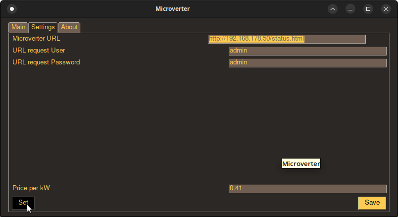

# Microverter

A small little script in Python gettig and dealing with data from a deye, bosswerk, e.g microverter.
That one's have a web interface which is accessable by a URL.

## Installation

Nothing to install, just download and start.

```bash
python -m microverter.py
```

## requirements

Look at requirements.txt file. Tested with :
* PySimpleGUI~=4.60.3
* requests~=2.28.1
* validators~=0.20.0

may other versions work.

```bash
pip install -r requirements.txt
```

## GUI or just one call CLI 

Look at the main body, at the end of file.
Comment the main() call with line comment (#) and uncomment the blockcomment (""""")
```python
# Main body
if __name__ == '__main__':
    main()
"""    
    # or call all the function manually ?
    # first connect direct with the micro inverter there is a ssid like AP_Serialnumber
    # WLAN Password for that normally is 12345678
    # then the start_url should be 10.10.100.254
    # there you could connect to access point or adhoc mode
    manual_inverter = BosswerkDeyeMicroinverter(start_url='http://192.168.178.50/status.html')
    if validators.url(manual_inverter.request_url):
        logging.info('URL is valid')
        manual_inverter.get_inverter_data(manual_inverter.request_url)
        manual_inverter.calc_data()
        print(f'Logger serial Number {manual_inverter.logger_serial}')
        print(f'Watt peak now     : {manual_inverter.wpeaknow} W ')
        print(f'and price per kWh : {manual_inverter.price_kw} \n')
        print(f'KiloWatt today    : {manual_inverter.kwtoday} kWh  earned {manual_inverter.price_today} ')
        print(f'KiloWatt total    : {manual_inverter.kwtotal} kWh  earned {manual_inverter.price_total}')
"""
```

## Contributing
Find a better solution? 
Feel free to make it aviable. 
May you send me a mail? 
But keep it simple.

## Screenshot (GUI)
{ width=60% }

## Goals
May later it would be possible to make a datalogger out of this. Without internet connection to the manufacturer servers.


## License
[CC BY-NC-SA ](https://creativecommons.org/licenses/by-nc-sa/3.0/de/)